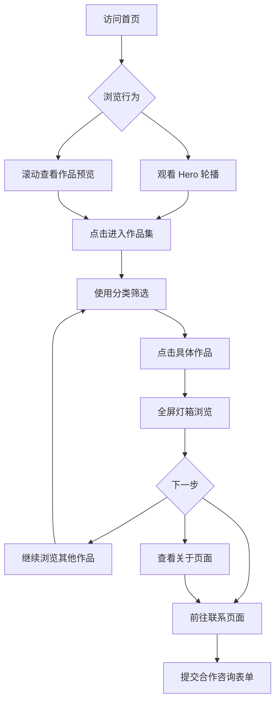

# 摄影作品集网站 - 产品需求文档 (PRD)

## 1. 产品概述

一个专业的个人摄影作品集展示网站，采用沉浸式画廊体验设计。网站致力于通过精致的视觉呈现和流畅的交互体验，展现摄影师的艺术视角与创作理念，吸引潜在客户与艺术爱好者。

**目标价值**：建立专业形象、展示作品实力、促进商业合作

## 2. 核心功能

### 2.1 用户角色

| 角色 | 访问方式 | 核心权限 |
|------|----------|----------|
| 访客 | 公开访问 | 浏览作品集、查看详情、联系方式 |

### 2.2 功能模块

1. **首页 (Home)**: 全屏 Hero 展示、最新作品预览、快速导航入口
2. **作品集 (Portfolio)**: 分类筛选、网格/瀑布流布局、悬停交互效果
3. **作品详情 (Gallery)**: 全屏灯箱浏览、图片信息展示、前后导航
4. **关于 (About)**: 摄影师简介、拍摄理念、服务范围
5. **联系 (Contact)**: 联系表单、社交媒体链接、合作咨询

### 2.3 页面详情

| 页面名称 | 模块名称 | 功能描述 |
|-----------|-------------|------------------|
| 首页 | Hero 区域 | 全屏轮播展示精选作品，带有优雅的文字叠加效果 |
| 首页 | 作品预览区 | 精选 6-8 幅作品的卡片式预览，带悬停放大效果 |
| 首页 | 快速导航 | 到达各分类作品集的快捷入口按钮 |
| 作品集 | 分类筛选栏 | 按主题分类（人像/风景/街拍/商业等）筛选切换 |
| 作品集 | 作品网格 | 响应式瀑布流/网格布局，支持多种排列方式 |
| 作品集 | 加载动画 | 图片渐入动画，错开延迟的入场效果 |
| 作品详情 | 灯箱查看器 | 全屏沉浸式图片浏览，支持键盘左右切换 |
| 作品详情 | 元数据面板 | 展示拍摄参数（光圈/快门/ISO）、地点、创作故事 |
| 关于 | 个人简介 | 摄影师头像、简介文字、获奖经历时间线 |
| 关于 | 服务项目 | 提供的摄影服务类型及价格区间参考 |
| 联系 | 联系表单 | 姓名、邮箱、项目类型、消息内容字段 |
| 联系 | 社交链接 | Instagram/Behance/微信等社交媒体图标链接 |

## 3. 核心流程

### 用户浏览流程

```
访客进入首页 → 被 Hero 视觉吸引 → 点击"查看作品"或滚动浏览预览 → 
进入作品集页面 → 使用分类筛选感兴趣的主题 → 点击某幅作品 → 
全屏灯箱模式欣赏细节 → 查看拍摄参数和创作背景 → 
返回作品集继续浏览 或 前往"关于"了解更多 → 
最终通过"联系"页面发起合作咨询
```



## 4. 用户界面设计

### 4.1 设计风格

**整体美学方向**: 编辑式画廊风格 (Editorial Gallery)

**色彩方案**:
- 主色调: `#0a0a0a` (深邃黑) - 主背景色
- 辅助色: `#fafafa` (暖白) - 文字与浅色元素
- 强调色: `#c9a96e` (古铜金) - 按钮、高亮、装饰线条
- 次要强调: `#2d2d2d` (深灰) - 卡片背景、分隔区域

**排版系统**:
- 标题字体: **Playfair Display** (衬线体) - 用于大标题、作品名称
- 正文字体: **Cormorant Garamond** (优雅衬线体) - 用于正文描述
- UI字体: **Outfit** (现代无衬线) - 用于按钮、标签、导航

**布局特点**:
- 不对称网格布局，打破常规对齐
- 大量负空间营造呼吸感
- 图片边缘溢出容器创造层次感
- 细线分割而非粗重边框

**交互特征**:
- 图片悬停时微妙的缩放 + 渐变遮罩浮现标题
- 平滑的页面过渡动画 (Page Transitions)
- 自定义光标样式（图片上变为十字准星）
- 滚动触发的视差效果和淡入动画

**图标/装饰**:
- 极简线条图标
- 装饰性几何图形（细线圆环、斜切角）
- 金色点缀元素用于视觉锚点

### 4.2 页面设计概览

| 页面名称 | 模块名称 | UI 元素 |
|-----------|-------------|-------------|
| 首页 | Hero 区域 | 全屏背景图 + 半透明黑色遮罩 + 居中大标题(Playfair Display, 72px) + 副标题 + "探索作品"CTA按钮(金色边框) + 底部滚动提示动画 |
| 首页 | 作品预览区 | 标题"精选作品" + 2列不对称网格(左大右小交替) + 悬停显示作品标题+分类标签 + 渐入动画(staggered delay) |
| 首页 | 快速导航 | 横向滚动的分类标签胶囊按钮 + 每个带对应风格的迷你缩略图 |
| 作品集 | 顶部区域 | 大标题 + 筛选按钮组(全部/人像/风景/街拍/商业) + 视图切换按钮(网格/列表) |
| 作品集 | 作品网格 | Masonry瀑布流布局 + 图片间距16px + 悬停时图片scale(1.03)+遮罩浮现 + 加载时opacity从0到1的渐入 |
| 作品详情 | 灯箱查看器 | 纯黑背景 + 居中最大尺寸显示图片 + 左右箭头导航 + 底部计数器(3/12) + ESC关闭 + 键盘左右切换 |
| 详情 | 信息面板 | 右侧滑出面板(桌面端)/下方展开(移动端) + 作品名称 + 拍摄参数表格 + 创作故事段落 + 返回按钮 |
| 关于 | 英雄区 | 大型肖像照(左侧60%) + 文字介绍(右侧40%) + 装饰性金色引号符号 |
| 关于 | 时间线 | 垂直时间线展示重要经历/奖项 + 圆点标记 + 年份标签 |
| 关于 | 服务区 | 3列卡片布局(人像写真/商业拍摄/活动记录) + 图标 + 标题 + 简述 + 价格区间 |
| 联系 | 表单区 | 左侧联系信息卡片(深色背景) + 右侧表单字段 + 输入框底部边框动画 + 发送按钮(金色填充) |
| 联系 | 社交区 | 社交媒体图标行 + 悬停颜色变化 + 微信二维码弹窗 |

### 4.3 响应式策略

**Desktop First 设计**:
- **桌面端 (≥1200px)**: 完整的多列布局、侧边栏信息面板、丰富的动效
- **平板端 (768px-1199px)**: 减少列数、调整间距、保留核心动效
- **移动端 (<768px)**: 单列堆叠布局、汉堡菜单、简化动效、触摸优化

**关键断点处理**:
- 导航栏在移动端变为汉堡菜单 + 全屏覆盖层
- 作品网格从多列变为单列
- 关于页面的图文从并排变为上下堆叠
- 联系表单从左右分栏变为上下排列
- 字号阶梯式缩小（h1: 72px → 48px → 36px）

## 5. 内容规划

### 5.1 示例作品数据

网站将包含以下分类的示例作品：

| 分类 | 数量 | 示例主题 |
|------|------|----------|
| 人像摄影 | 6-8 张 | 肖像、时尚、情绪表达 |
| 风景风光 | 6-8 张 | 自然景观、城市天际线、日出日落 |
| 街头纪实 | 4-6 张 | 城市生活、人文瞬间 |
| 商业拍摄 | 4-6 张 | 产品、品牌、空间 |

### 5.2 占位文案结构

- 首页 Hero: 一句富有诗意的摄影理念宣言
- 关于页面: 摄影师的创作哲学和经历叙述
- 作品描述: 每幅作品的简短创作背景说明
