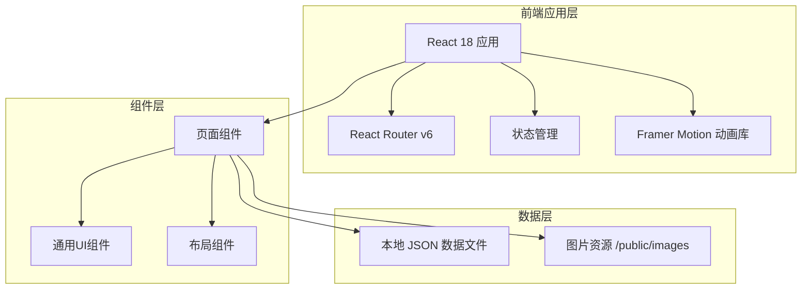

# 摄影作品集网站 - 技术架构文档

## 1. 架构设计



**架构特点**:
- 纯静态前端应用，无需后端服务
- 数据通过本地 JSON 文件管理，便于更新维护
- 图片资源存放于 public 目录，支持懒加载优化
- 采用组件化架构，便于复用和维护

## 2. 技术选型

| 技术栈 | 版本 | 用途说明 |
|--------|------|----------|
| React | 18.x | 核心UI框架，组件化开发 |
| Vite | 5.x | 构建工具，快速开发服务器 |
| Tailwind CSS | 3.x | 原子化CSS框架，快速实现响应式设计 |
| Framer Motion | 11.x | 高级动画库，实现复杂交互动效 |
| React Router | 6.x | 客户端路由管理 |
| react-icons | 5.x | 图标库 |
| Swiper | 11.x | 首页Hero轮播组件 |
| react-intersection-observer | 9.x | 滚动视口检测，触发动画 |

**初始化工具**: Vite (create-vite)

**包管理器**: npm / pnpm

## 3. 项目目录结构

```
photography-portfolio/
├── public/
│   └── images/
│       ├── hero/              # 首页轮播大图
│       ├── portfolio/         # 作品集图片
│       │   ├── portrait/      # 人像摄影
│       │   ├── landscape/     # 风景风光
│       │   ├── street/        # 街头纪实
│       │   └── commercial/    # 商业拍摄
│       ├── about/             # 关于页面图片
│       └── icons/             # favicon等图标资源
├── src/
│   ├── assets/                # 静态资源（字体、全局样式）
│   │   └── fonts/             # 自定义字体文件
│   ├── components/            # 可复用组件
│   │   ├── layout/            # 布局组件
│   │   │   ├── Navbar.jsx     # 导航栏
│   │   │   ├── Footer.jsx     # 页脚
│   │   │   └── PageTransition.jsx # 页面过渡动画
│   │   ├── ui/                # 基础UI组件
│   │   │   ├── Button.jsx     # 按钮组件
│   │   │   ├── ImageCard.jsx  # 图片卡片
│   │   │   ├── FilterBar.jsx  # 筛选栏
│   │   │   └── Lightbox.jsx   # 灯箱组件
│   │   └── sections/          # 页面区块组件
│   │       ├── HeroSection.jsx
│   │       ├── PortfolioGrid.jsx
│   │       └── ContactForm.jsx
│   ├── pages/                 # 页面组件
│   │   ├── Home.jsx           # 首页
│   │   ├── Portfolio.jsx      # 作品集
│   │   ├── Gallery.jsx        # 作品详情
│   │   ├── About.jsx          # 关于
│   │   └── Contact.jsx        # 联系
│   ├── data/                  # 数据文件
│   │   ├── works.js           # 作品数据
│   │   ├── categories.js      # 分类数据
│   │   └── about.js           # 关于页面数据
│   ├── hooks/                 # 自定义Hooks
│   │   ├── useScrollAnimation.js
│   │   └── useLightbox.js
│   ├── styles/                # 全局样式
│   │   └── globals.css        # Tailwind基础 + 自定义样式
│   ├── App.jsx                # 根组件
│   └── main.jsx               # 入口文件
├── index.html
├── tailwind.config.js
├── vite.config.js
├── postcss.config.js
└── package.json
```

## 4. 路由定义

| 路由路径 | 页面组件 | 说明 |
|----------|----------|------|
| `/` | Home | 首页 |
| `/portfolio` | Portfolio | 作品集列表 |
| `/portfolio/:category` | Portfolio | 指定分类的作品集 |
| `/gallery/:id` | Gallery | 作品详情（灯箱模式） |
| `/about` | About | 关于摄影师 |
| `/contact` | Contact | 联系方式 |

## 5. 数据模型

### 5.1 作品数据模型

```javascript
// data/works.js
const works = [
  {
    id: 1,
    title: "晨曦中的城市",
    category: "landscape", // portrait | landscape | street | commercial
    imageUrl: "/images/portfolio/landscape/city-dawn.jpg",
    thumbnailUrl: "/images/portfolio/landscape/city-dawn-thumb.jpg",
    description: "清晨五点的城市天际线，第一缕阳光穿透云层...",
    story: "这张作品拍摄于2024年春...",
    technical: {
      camera: "Sony A7R V",
      lens: "24-70mm f/2.8",
      aperture: "f/8",
      shutter: "1/250s",
      iso: 100,
      location: "上海陆家嘴",
      date: "2024-03-15"
    },
    featured: true, // 是否在首页展示
    tags: ["城市", "日出", "建筑"]
  },
  // ... 更多作品
];
```

### 5.2 分类数据模型

```javascript
// data/categories.js
const categories = [
  { id: "all", name: "全部", icon: "grid", count: 24 },
  { id: "portrait", name: "人像", icon: "user", count: 8 },
  { id: "landscape", name: "风景", icon: "mountain", count: 8 },
  { id: "street", name: "街拍", icon: "camera", count: 6 },
  { id: "commercial", name: "商业", icon: "briefcase", count: 6 }
];
```

## 6. 核心技术实现方案

### 6.1 动画策略

**Framer Motion 配置要点**:

```javascript
// 页面过渡动画
const pageVariants = {
  initial: { opacity: 0, y: 20 },
  animate: { opacity: 1, y: 0, transition: { duration: 0.6, ease: "easeOut" } },
  exit: { opacity: 0, y: -20, transition: { duration: 0.4 } }
};

// 图片卡片悬停效果
const cardHover = {
  rest: { scale: 1 },
  hover: { scale: 1.03, transition: { duration: 0.4, ease: "easeOut" } }
};

// 错开入场动画 (Stagger)
const containerVariants = {
  hidden: {},
  visible: {
    transition: { staggerChildren: 0.1 }
  }
};
```

**滚动触发动画** (react-intersection-observer):
- 作品卡片进入视口时触发 fade-up 动画
- 关于页面的时间线逐项显现
- 数字统计的计数动画

### 6.2 图片优化策略

- 使用现代格式: WebP (主) + JPEG (回退)
- 响应式图片: srcset 提供多种尺寸
- 懒加载: Intersection Observer API 实现可视区域加载
- 缩略图: 先加载模糊小图再渐进增强
- 占位符: 使用 CSS 渐变或 SVG 作为 loading 状态

### 6.3 性能优化指标

| 指标 | 目标值 |
|------|--------|
| 首次内容绘制 (FCP) | < 1.5s |
| 最大内容绘制 (LCP) | < 2.5s |
| 累积布局偏移 (CLS) | < 0.1 |
| 首次输入延迟 (FID) | < 100ms |

**优化手段**:
- 代码分割: React.lazy + Suspense 实现路由级代码分割
- 图片懒加载: 减少首屏加载数量
- Tailwind CSS Purge: 生产环境移除未使用的样式
- Vite 构建: 快速的热更新和生产构建

## 7. 第三方服务集成

本阶段不集成第三方服务，所有数据均为本地静态数据。如后续需要可扩展：

- **评论系统**: Disqus 或自定义评论后端
- **表单后端**: Formspree 或 Netlify Forms
- **分析**: Google Analytics 或 Plausible
- **图床**: Cloudinary 或自建 CDN

## 8. 开发规范

### 8.1 代码规范

- 使用 ES6+ 语法
- 函数组件 + Hooks
- TypeScript 类型标注（可选）
- ESLint + Prettier 格式化

### 8.2 Git 工作流

- main: 生产分支
- develop: 开发分支
- feature/*: 功能分支

### 8.3 浏览器兼容性

- Chrome/Edge: 最新2个版本
- Firefox: 最新2个版本
- Safari: 最新2个版本
- 移动端: iOS Safari 14+, Chrome Mobile (最新)
